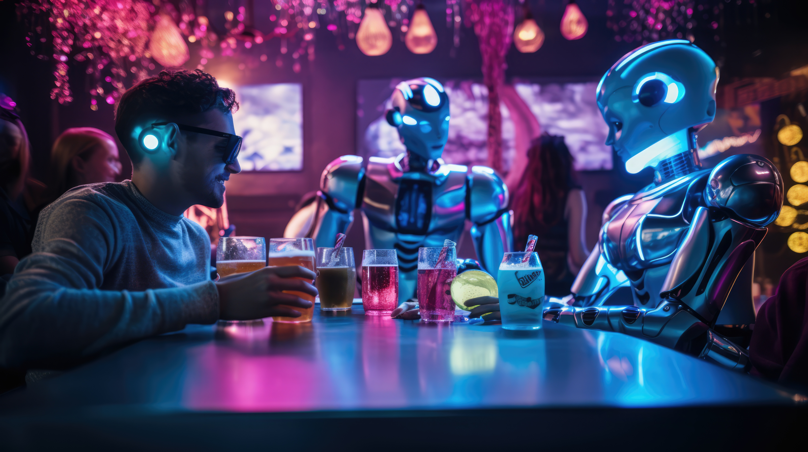

# MR-MLL-PHI    
Siempre he soñado con tener mi propio camarero virtual y hoy me he lanzado a crear uno, un asistente chatbot que te consuela emocionalmente, te cuenta historias sobre su taberna virtual y además te da las mejores recetas de cocteles.  
A nivel técnico, he creado una API con FastAPI en la que he integrado un modelo gratuito de Hugging Face, el cual cada vez que un usuario se conecta para interactuar con él, registra en una base de datos alojada en AWS (el servicio en la nube de Amazon) cada pregunta y respuesta.

## Instalación

1. Clona este repositorio:
   ```bash
   git clone https://github.com/borjabarber/MR-MLL-PHI.git
   
2. Instala las dependencias:
   ```bash
   pip install -r requirements.txt

## Indice del repositorio  
📂 img (Todas las imagenes para el proyecto)  
📂 templates (Codigo HTML para el front-end en el endpoint (/chat))   
│── 📄 .dockerignore    
│── 📄 .gitignore  
│── 📄 .dockerfile  
│── 📄 LICENSE  
│── 📄 Prompts.txt  
│── 📄 README.md  
│── 📄 docker-compose.yml  
│── 📄 main.py  
│── 📄 requirements.txt  
│── 📄 test.py  
  
# Comando de arranque:
Introducir en consola:
   ```bash
   uvicorn main:app
```

----

## Gracias

MIT License

Copyright (c) 2025 Borja Barber

Permission is hereby granted, free of charge, to any person obtaining a copy
of this software and associated documentation files (the "Software"), to deal
in the Software without restriction, including without limitation the rights
to use, copy, modify, merge, publish, distribute, sublicense, and/or sell
copies of the Software, and to permit persons to whom the Software is
furnished to do so, subject to the following conditions:

The above copyright notice and this permission notice shall be included in all
copies or substantial portions of the Software.

THE SOFTWARE IS PROVIDED "AS IS", WITHOUT WARRANTY OF ANY KIND, EXPRESS OR
IMPLIED, INCLUDING BUT NOT LIMITED TO THE WARRANTIES OF MERCHANTABILITY,
FITNESS FOR A PARTICULAR PURPOSE AND NONINFRINGEMENT. IN NO EVENT SHALL THE
AUTHORS OR COPYRIGHT HOLDERS BE LIABLE FOR ANY CLAIM, DAMAGES OR OTHER
LIABILITY, WHETHER IN AN ACTION OF CONTRACT, TORT OR OTHERWISE, ARISING FROM,
OUT OF OR IN CONNECTION WITH THE SOFTWARE OR THE USE OR OTHER DEALINGS IN THE
SOFTWARE.
